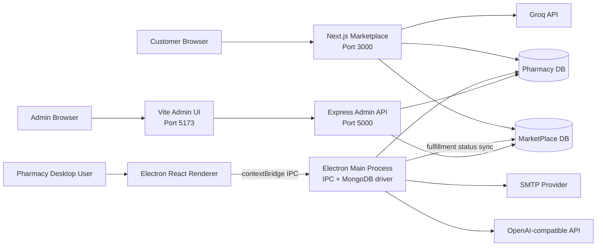
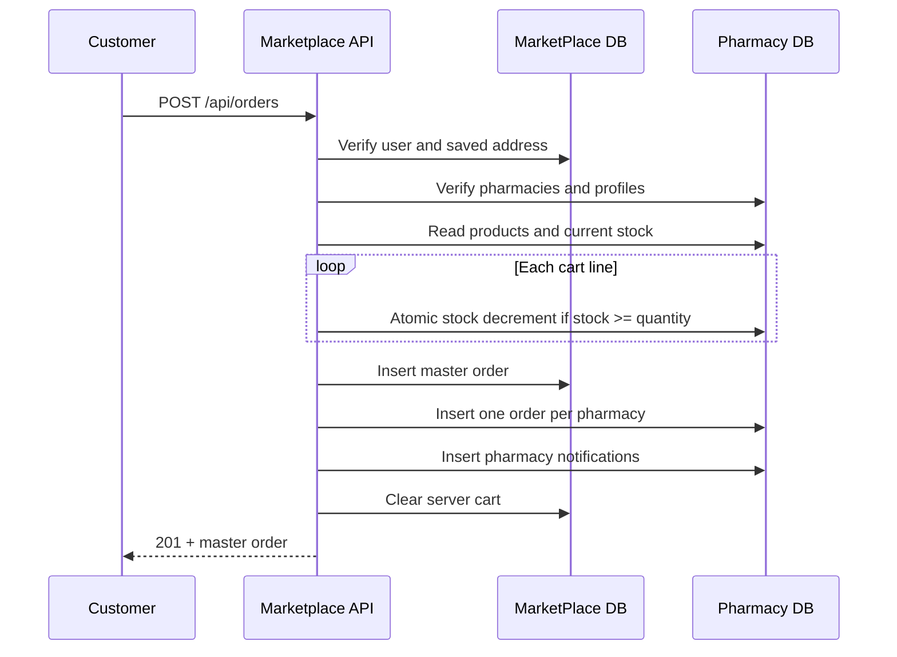
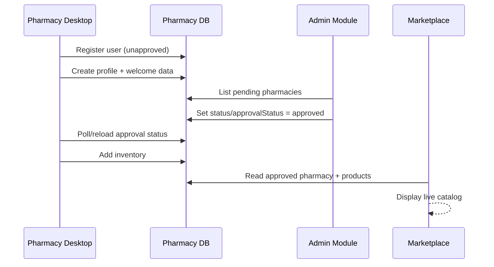
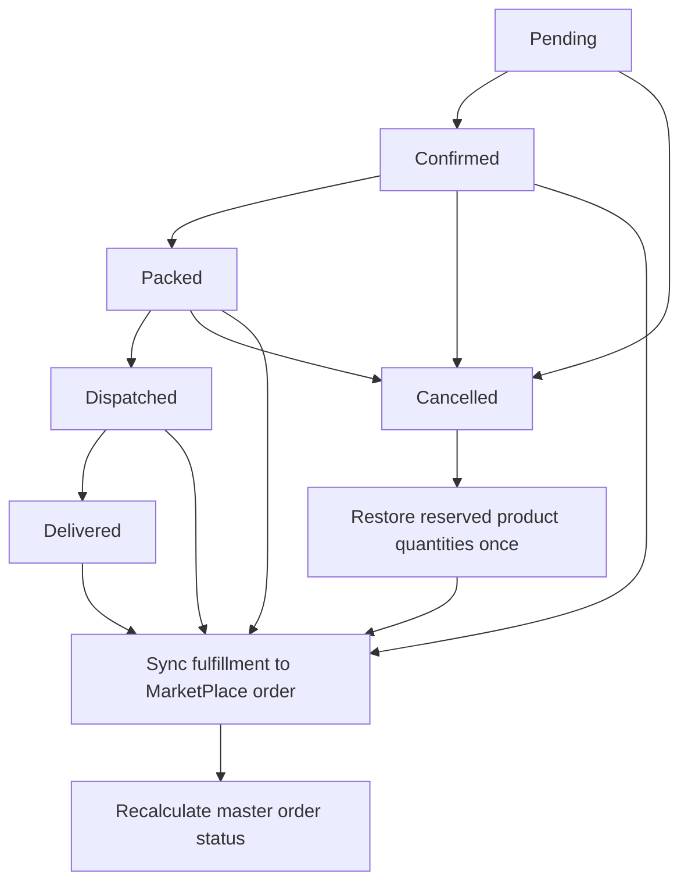

# DawaConnect FYP — Complete AI Handoff and Technical Context

> Last verified against the repository: 2026-09-13 (Admin module rebuilt; complaints added across modules)  
> Workspace root: `C:\Users\Dell\Desktop\DAWA_CONNECT`

## 1. Purpose of this document

This file is the main technical handoff for the complete DawaConnect final-year project (FYP). It is intended for AI coding assistants and human developers who need to understand the project before changing it.

Read this document before editing any module. The three modules are connected and cannot be treated as unrelated applications. They share MongoDB data, identifiers, approval states, inventory, and order status.

This document describes:

- What the FYP is trying to achieve.
- The three modules and their responsibilities.
- How the modules communicate.
- The two MongoDB databases and their collections.
- The complete customer-to-pharmacy commerce workflow.
- Authentication and authorization behavior.
- API and Electron IPC contracts.
- Setup and run commands.
- Important invariants that must not be broken.
- Current limitations, placeholders, and security concerns.
- Recommended priorities for future development.

No real passwords, API keys, JWT secrets, SMTP credentials, or database credentials are included here.

---

## 2. Project summary

DawaConnect is a multi-module medicine-commerce and pharmacy-management platform. It connects customers, pharmacies, and platform administrators.

The intended business flow is:

1. A pharmacy registers through the Pharmacy desktop application.
2. An administrator reviews and approves the pharmacy.
3. The pharmacy maintains its profile, delivery settings, tax rate, and medicine inventory.
4. Approved pharmacy inventory becomes visible in the customer Marketplace.
5. A customer searches real inventory, adds products to a cart, saves a delivery address, and checks out.
6. Checkout reserves stock and creates:
   - one customer-facing master order; and
   - one pharmacy fulfillment order for every pharmacy represented in the cart.
7. Each pharmacy processes only its own fulfillment.
8. Pharmacy status changes synchronize back to the customer's master order.
9. If a pharmacy cancels before dispatch, its reserved inventory is restored exactly once.
10. The customer tracks both the overall order and each pharmacy fulfillment.

The system currently supports cash on delivery. Card payment UI is intentionally disabled until a real payment gateway is implemented.

---

## 3. Repository/module layout

```text
DAWA_CONNECT/
├── FYP_AI_CONTEXT.md                 # This handoff document
├── dawa-connect-market-place/        # Customer Marketplace (Next.js)
├── dawaconnect/                      # Pharmacy desktop module (Electron + React)
└── Admin module/                     # Admin frontend + Express backend
```

### Module overview

| Module | Primary users | Runtime | Main responsibility |
|---|---|---|---|
| Customer Marketplace | Medicine customers | Next.js web application | Customer authentication, live product discovery, cart, checkout, orders, tracking, prescriptions, saved items, AI assistant |
| Pharmacy Module | Pharmacy owner/staff | Electron desktop application | Pharmacy registration, inventory, fulfillment processing, analytics, profile/delivery/tax settings, returns, reviews, notifications, chat |
| Admin Module | Platform admins | Vite React frontend + Express API | Customer moderation, pharmacy approval/suspension, pharmacy/product inspection, admin management |

---

## 4. High-level architecture



### Important architectural fact

There is no separate integration microservice. Integration happens through shared MongoDB databases:

- The Marketplace server reads the Pharmacy database directly for approved pharmacies and inventory.
- Marketplace checkout writes to both databases in one MongoDB transaction.
- The Pharmacy Electron main process updates pharmacy orders and writes resulting fulfillment status back to the MarketPlace database.
- The Admin Express API has one Mongoose connection for each database.

This design requires the MongoDB deployment to support transactions. MongoDB Atlas replica-set clusters normally do.

---

## 5. Logical databases

The code expects exactly two case-sensitive logical database names:

| Database | Purpose |
|---|---|
| `MarketPlace` | Customer accounts, customer carts/addresses, master orders, prescriptions, saved items, searches, and admins |
| `Pharmacy` | Pharmacy accounts, profiles, inventory, fulfillment orders, operational data, sessions, and pharmacy chat |

Do not rename these databases without changing all three modules.

### Current cluster state

On 2026-08-26, the newly configured MongoDB credentials authenticated successfully, but a read-only check reported no collections in either `MarketPlace` or `Pharmacy`. The code still retains the expected database and collection structure, but previous data was not migrated to the new cluster.

Consequences:

- The Admin UI will return empty live customer/pharmacy/order lists until data is created.
- The Marketplace catalog will be empty until pharmacies register, are approved, and add inventory.
- Starting the Pharmacy app runs index initialization and may create its expected collections.
- If old data is needed, it must be restored from the previous cluster or a backup.

---

## 6. Cross-module identity and ownership rules

These rules are critical.

### Customer IDs

- A customer is stored in `MarketPlace.users`.
- Its primary key is MongoDB `ObjectId`.
- Marketplace API authentication places the string form of that ID in JWT field `userId`.
- `MarketPlace.orders.userId`, `prescriptions.userId`, and `saveditems.userId` are ObjectId references.

### Pharmacy IDs

- A pharmacy account is stored in `Pharmacy.users`.
- The pharmacy's public/business identifier is the string form of `Pharmacy.users._id`.
- Pharmacy-owned documents use:

```js
ownerId: pharmacyUser._id.toString()
```

- In the current Pharmacy database, `ownerId` is normally a string, not an ObjectId.
- Marketplace product and pharmacy APIs return this value as `pharmacyId`.

### Product IDs

- A product is stored in `Pharmacy.products`.
- Its identifier is `products._id` (ObjectId).
- Marketplace clients carry it as a string in `productId`.
- A valid cart line is uniquely identified by both pharmacy and product:

```text
cartItemId = pharmacyId + "-" + productId
```

### Cross-database order IDs

One checkout creates:

- `MarketPlace.orders._id`: master order ObjectId.
- `MarketPlace.orders.orderId`: customer-readable ID such as `DC-...-...`.
- `Pharmacy.orders.id`: fulfillment ID such as `<customerOrderId>-01`.
- `Pharmacy.orders.marketplaceOrderId`: string form of the master order ObjectId.
- `Pharmacy.orders.customerOrderId`: the customer-readable master order ID.
- `MarketPlace.orders.fulfillments[].pharmacyOrderId`: matching pharmacy fulfillment ID.

Do not replace these links with pharmacy names or product names. IDs are authoritative.

---

# Part I — Customer Marketplace

## 7. Marketplace module overview

Path:

```text
dawa-connect-market-place/
```

Technology:

- Next.js 16 App Router
- React 19
- Tailwind CSS
- Mongoose
- JWT signing/verification using `jose`
- Password hashing using `bcryptjs`
- Groq for the customer AI assistant and voice-intent parsing
- Leaflet dependencies remain installed, although the current pharmacy map route redirects to the live pharmacy directory

Main entry/layout files:

- `src/app/layout.js`
- `src/app/page.js`
- `src/context/AuthContext.js`
- `src/context/CartContext.js`
- `src/components/ConditionalChrome.jsx`

The root layout wraps the application with:

1. `AuthProvider`
2. `CartProvider`
3. conditional Navbar/Footer chrome

## 8. Marketplace pages

> 2026-09-13: added `/dashboard/complaints` (Support & Complaints) and a "Report a problem" link per order in `/dashboard/orders`.

| Route | Purpose |
|---|---|
| `/` | Homepage with search, live recommended inventory, recent/frequent searches, customer dashboard snippets, and approved pharmacies |
| `/signup` | Customer registration |
| `/login` | Customer login |
| `/search` | Live inventory search, filtering, sorting, pagination, add-to-cart |
| `/search/list` | Legacy route; redirects to `/search` |
| `/product/[id]` | Live product detail loaded from Pharmacy inventory |
| `/pharmacies` | Directory of approved Pharmacy accounts |
| `/pharmacies/[id]` | Pharmacy profile and its current non-expired inventory |
| `/pharmacies/map` | Currently redirects to `/pharmacies` |
| `/cart` | Cart editing and totals |
| `/checkout` | Address selection, COD selection, order review, transactional checkout |
| `/track/[id]` | Polling customer order and per-pharmacy fulfillment tracking |
| `/assistant` | Streaming AI medical/platform assistant |
| `/dashboard` | Customer dashboard |
| `/dashboard/orders` | Customer order history |
| `/dashboard/addresses` | Saved delivery-address CRUD |
| `/dashboard/prescriptions` | Prescription history/upload UI |
| `/dashboard/saved` | Saved live products |
| `/dashboard/settings` | Customer account/settings UI |
| `/notifications` | Currently a static placeholder notification screen; not yet connected to a customer notification collection |

## 9. Marketplace live catalog

Core file:

```text
src/lib/pharmacyCatalog.js
```

This is server-only code. It connects to the configured `MarketPlace` database using Mongoose, obtains the underlying MongoDB client, and opens the sibling `Pharmacy` database.

### Pharmacy eligibility

A pharmacy appears in the Marketplace only when:

- `Pharmacy.users.approvalStatus` matches `approved` case-insensitively.
- `Pharmacy.users.status` is not `suspended`.

The Marketplace derives display fields from both:

- registration document: `Pharmacy.users`
- editable business profile: `Pharmacy.profiles`

The profile normally wins for name, address, hours, delivery charge, delivery type, tax rate, and open/closed status.

### Product eligibility

A product is catalog-eligible when:

- It belongs to an eligible pharmacy through `product.ownerId`.
- Its expiry is missing/empty/null, or its `YYYY-MM-DD` expiry is today or later.
- Optional search filters are satisfied.
- `inStockOnly=true` additionally requires `stock > 0`.

Searchable product fields:

- `name`
- `category`
- `supplier`

Supported search inputs:

- `query`
- `page`
- `limit`
- `minPrice`
- `maxPrice`
- `minRating`
- `inStockOnly`
- `deliveryOnly`
- `sortBy`: `relevance`, `lowest-price`, `highest-rated`, or `stock`

Ratings only include reviews explicitly marked:

```js
source: "marketplace"
```

This prevents old pharmacy demo/internal reviews from becoming public Marketplace ratings. A full Marketplace review-creation workflow is not implemented yet.

## 10. Marketplace cart

Core files:

- `src/context/CartContext.js`
- `src/app/api/cart/route.js`
- embedded `cartItems` array in `MarketPlace.users`

Guest cart behavior:

- Stored in browser `localStorage` under `dawaconnect_cart_items`.

Authenticated cart behavior:

- Stored in `users.cartItems`.
- Synchronized through `GET /api/cart` and `PUT /api/cart`.
- Guest items are merged into the server cart after login.
- Cart state is cleared when switching users to prevent cross-account leakage.

The client cart stores display data for responsiveness, but checkout does not trust client prices, taxes, delivery fees, or product names.

## 11. Marketplace checkout and order creation

Core file:

```text
src/lib/commerce.js
```

API:

```text
POST /api/orders
```

Accepted client payload:

```json
{
  "items": [
    {
      "productId": "PRODUCT_OBJECT_ID_STRING",
      "pharmacyId": "PHARMACY_USER_OBJECT_ID_STRING",
      "quantity": 2
    }
  ],
  "addressId": "CUSTOMER_ADDRESS_SUBDOCUMENT_ID",
  "paymentMethod": "cash"
}
```

### Server-side validations

Checkout verifies:

- Customer JWT and customer ObjectId.
- Customer exists and is not suspended.
- Selected address belongs to that customer.
- Every pharmacy ID is valid.
- Every pharmacy is approved and not suspended.
- Pharmacy profile is open.
- Every product exists.
- Product belongs to the requested pharmacy.
- Product is not expired.
- Quantity is an integer from 1 to 999.
- Current stock is sufficient.
- Only cash payment is currently accepted.

### Pricing authority

The server recalculates:

- Product unit price from `Pharmacy.products.price`.
- Line totals.
- Per-pharmacy subtotal.
- Tax from `Pharmacy.profiles.taxRate`.
- Delivery fee from the pharmacy profile/registration settings.
- One platform processing fee of PKR 100 per master checkout.

Client-provided prices are ignored.

### Atomic transaction

Checkout uses one MongoDB session and `withTransaction` across both logical databases.



Any failure aborts the transaction, including all inventory decrements.

## 12. Customer master order status

Master order statuses:

- `Processing`
- `Confirmed`
- `Packed`
- `Dispatched`
- `Delivered`
- `Partially Delivered`
- `Cancelled`

The master order may contain multiple pharmacy fulfillments. Its overall status is an aggregate of fulfillment statuses:

- All cancelled → `Cancelled`
- All delivered → `Delivered`
- All terminal but mixed delivered/cancelled → `Partially Delivered`
- Any dispatched/delivered while others remain active → `Dispatched`
- Any packed → `Packed`
- All confirmed → `Confirmed`
- Otherwise → `Processing`

The tracking page polls `GET /api/orders?orderId=...` every 10 seconds.

## 13. Marketplace authentication

Customer registration:

- Requires name, email, password, phone, and city.
- Password must be at least eight characters with uppercase, number, and special character.
- Password is hashed with bcrypt.
- New customer status is `active`.

Customer login:

- Rejects suspended users.
- Creates an HS256 JWT with seven-day expiry.
- Stores JWT in HTTP-only `auth_token` cookie.
- Cookie is `sameSite=lax`.
- Cookie is secure only in production.

Most customer-specific endpoints independently verify the JWT.

## 14. Marketplace API reference

| Endpoint | Methods | Authentication | Responsibility |
|---|---|---|---|
| `/api/auth/signup` | POST | No | Create customer |
| `/api/auth/login` | POST | No | Verify customer and set JWT cookie |
| `/api/auth/me` | GET | Cookie | Restore customer session |
| `/api/auth/logout` | POST | Cookie optional | Expire auth cookie |
| `/api/pharmacies` | GET | No | List approved live pharmacies |
| `/api/search` | GET | No | Search Pharmacy inventory |
| `/api/cart` | GET, PUT | Yes | Read/write authenticated cart |
| `/api/orders` | GET, POST | Yes | Order history/detail and transactional checkout |
| `/api/user/addresses` | GET, POST, PATCH, DELETE | Yes | Address management; PATCH sets default |
| `/api/saved` | GET, POST, DELETE | Yes | Save/remove products; revalidates against live catalog |
| `/api/prescriptions` | GET, POST | Yes | List/upload prescriptions |
| `/api/recent-searches` | GET, POST, DELETE | User or guest session | Recent/frequent query history |
| `/api/chat` | POST | No explicit customer auth | Streaming Groq assistant response |
| `/api/voice-search-intent` | POST | No | Convert speech transcript into short medicine query |

## 15. Marketplace database collections

### `MarketPlace.users`

Important fields:

- `_id: ObjectId`
- `name`
- `email` (unique)
- `password` (bcrypt hash)
- `status: active | suspended`
- `phone`
- `city`
- `cartItems[]`
  - `cartItemId`
  - `id`
  - `productId`
  - `name`
  - `category`
  - `image`
  - `pharmacyId`
  - `pharmacyName`
  - `timing`
  - `deliveryCharge`
  - `taxRate`
  - `deliveryType`
  - `price`
  - `quantity`
- `addresses[]`
  - `_id` generated by Mongoose
  - `label`
  - `fullName`
  - `phone`
  - `line1`
  - `line2`
  - `city`
  - `province`
  - `postalCode`
  - `isDefault`
- `createdAt`, `updatedAt`

### `MarketPlace.orders`

Important fields:

- `_id: ObjectId`
- `userId: ObjectId`
- `orderId: string` (unique customer-readable ID)
- `items[]`
  - `productId`
  - `pharmacyId`
  - `pharmacyName`
  - `name`, `category`, `unit`
  - `quantity`, `price`, `lineTotal`
- `fulfillments[]`
  - `pharmacyId`
  - `pharmacyName`
  - `pharmacyOrderId`
  - `status`
  - `itemCount`
  - `subtotal`, `tax`, `deliveryFee`, `total`
  - `updatedAt`
- `subtotal`
- `tax`
- `deliveryFee`
- `processingFee`
- `total`
- `status`
- `paymentMethod: cash | card`
- `paymentStatus`
- `deliveryAddress` snapshot
- `estimatedDelivery`
- timestamps

### Other MarketPlace collections

| Collection | Main fields/purpose |
|---|---|
| `prescriptions` | `userId`, title, original file name, local file URL, status, notes |
| `saveditems` | `userId`, `productId`, `pharmacyId`, cached name/price/category |
| `recentsearches` | user or guest `sessionId`, query, searchCount, timestamps |
| `admins` | Admin accounts created by Admin module |
| `complaints` | Shared complaints (see section 28a) |
| `auditlogs` | Admin action history written by the Admin module |

---

# Part II — Pharmacy Desktop Module

## 16. Pharmacy module overview

Path:

```text
dawaconnect/
```

Technology:

- Electron 31
- electron-vite
- React 18
- Native MongoDB Node driver
- bcrypt
- Nodemailer
- Recharts
- Optional OpenAI-compatible chat-completions API

Process separation:

- `src/`: sandboxed renderer UI.
- `electron/preload.js`: safe `contextBridge` API.
- `electron/main.js`: Electron lifecycle, IPC handlers, AI requests.
- `electron/db.js`: database operations and commerce synchronization.

Renderer code must not import the MongoDB driver or Node secrets. Database access belongs in the main process and is exposed through IPC.

## 17. Pharmacy user flow

1. First launch displays onboarding unless `localStorage.onboardingDone === "1"`.
2. Pharmacy registers using a multi-step form.
3. Registration creates an unapproved Pharmacy user and profile.
4. Pharmacy can log in, but inventory/orders are blocked until admin approval.
5. Admin changes `status` and `approvalStatus` to `approved`.
6. Pharmacy manages inventory and receives Marketplace orders.
7. Renderer polls products, orders, and notifications every 10 seconds.

Registration fields include:

- `pharmacyName`
- `ownerName`
- `email`
- `phone` (normalized to 11 digits)
- password/confirmation
- `addressLine1`
- `area`
- `city`
- `province`
- `openingTime`
- `closingTime`
- `deliveryCharge`
- `serviceRadiusKm`
- `licenseNumber`
- `cnic` (13 digits)

Password requirement: at least eight characters, one uppercase character, and one special character.

## 18. Pharmacy pages

> 2026-09-13: added **Complaints** (`src/pages/Complaints.jsx`, nav id `complaints`) with a customer complaints inbox and "Contact DawaConnect"; Inventory/Orders blocked screens now show the admin's rejection/suspension reason.

| Page | Responsibility |
|---|---|
| Dashboard | Live operational summaries, low stock/expiry alerts, recent orders, charts |
| Orders | Search/filter orders, view details, invoice display, controlled status transitions |
| Inventory | Add/edit/delete medicines, category/stock filtering, low-stock and expiry state |
| Analytics | Sales/revenue charts and derived business data |
| Returns & Refunds | View and approve/reject return records |
| Live Customer Chat | Order-derived threads, stored messages, attachments, AI-assisted replies, debug logs |
| Reviews & Ratings | Pharmacy-scoped review summaries |
| Notifications | Pharmacy-scoped notifications and mark-all-read |
| Pharmacy Profile | Public profile, open/closed state, delivery, tax, and payment-account settings |

The README mentions some broader features such as recalls, payment reconciliation, bulk upload, and reports. Always verify the current code before assuming every README feature has a complete implementation.

## 19. Pharmacy inventory

Inventory is stored in `Pharmacy.products`.

Current product fields:

- `_id: ObjectId`
- `ownerId: string`
- `name`
- `category`
- `price: number`
- `stock: number`
- `threshold: number`
- `expiry: YYYY-MM-DD string`
- `batch`
- `supplier`
- `unit`
- optional `image`
- timestamps

Supported categories in the renderer:

- Analgesic
- Antibiotic
- Antidiabetic
- Antacid
- Antihistamine
- Anti-inflammatory
- Cardiovascular
- Supplement
- Antiviral
- Dermatology
- Other

Inventory CRUD always includes the signed-in pharmacy's `ownerId` in its database filter. This is the primary tenant-isolation mechanism.

Approval gating:

- Unapproved or suspended pharmacies cannot use the inventory workspace.
- The Marketplace independently checks approval and suspension again.

## 20. Pharmacy order processing

Marketplace fulfillments enter `Pharmacy.orders` with:

- `source: "marketplace"`
- `ownerId`
- `id` fulfillment order ID
- `marketplaceOrderId`
- `customerOrderId`
- customer identity/contact snapshot
- fulfillment items
- pricing/tax/delivery totals
- delivery address snapshot
- payment state
- inventory reservation flags

Allowed transitions:

```text
Pending   -> Confirmed | Cancelled
Confirmed -> Packed    | Cancelled
Packed    -> Dispatched| Cancelled
Dispatched-> Delivered
Delivered -> terminal
Cancelled -> terminal
```

The transition rules are enforced in the database layer, not only hidden in the UI.

### Cancellation behavior

When cancelling a Marketplace fulfillment:

- It must have `inventoryReserved: true`.
- It must not already have `inventoryRestocked: true`.
- Every product is incremented by the fulfillment quantity.
- The order receives:
  - `inventoryRestocked: true`
  - `inventoryRestockedAt`

The transaction then updates the matching master fulfillment in `MarketPlace.orders` and recalculates the overall master status.

## 21. Pharmacy authentication and sessions

Passwords are stored in `passwordHash`.

On successful login:

- A random 48-byte hex session token is generated.
- Token is stored in `Pharmacy.sessions`.
- Session expiry is 30 days.
- Renderer stores the returned session/user object in localStorage as `sessionUser`.
- App startup calls the restore-session IPC method.
- Logout revokes the current session.

Session collection has a TTL index on `expiresAt`.

Password reset:

- Generates a six-digit OTP.
- OTP expires in 10 minutes.
- SMTP delivery is used when configured.
- Reset-attempt metadata is stored on the user document.

## 22. Pharmacy IPC surface

`electron/preload.js` exposes `window.electronAPI`.

### Authentication IPC

- `auth.register`
- `auth.registrationAvailability`
- `auth.login`
- `auth.restore`
- `auth.logout`
- `auth.forgotRequest`
- `auth.forgotReset`

### Product IPC

- `products.list`
- `products.create`
- `products.update`
- `products.remove`

### Generic pharmacy entity IPC

- `entity.list`
- `entity.create`
- `entity.update`
- `entity.remove`

The generic mechanism is used for collections such as:

- orders
- staff
- reviews
- returns
- notifications

Order status updates are intercepted by specialized transactional logic in `electron/db.js`.

### Profile IPC

- `profile.get`
- `profile.save`

### Chat IPC

- `chat.ask`
- `chat.syncThreads`
- `chat.listMessages`
- `chat.sendMessage`
- `chat.logs`

All IPC handlers return a normalized envelope:

```js
{ ok: true, data }
// or
{ ok: false, error: "message" }
```

## 23. Pharmacy AI assistant

The Pharmacy chat assistant runs from the Electron main process.

When `OPENAI_API_KEY` exists:

- Uses an OpenAI-compatible chat-completions endpoint.
- Default model: `gpt-4o-mini`.
- Default base URL: OpenAI chat completions.
- Supplies up to 200 inventory items and 200 orders as structured context.
- Supplies the last 10 messages.
- Logs questions, responses/errors, model, latency, and guardrail outcome.

Without an API key:

- Provides limited deterministic answers for low-stock and order-count questions.

Basic harmful-request keyword guardrails run before the external AI call.

## 24. Pharmacy database collections

### `Pharmacy.users`

Contains registration/authentication data:

- `_id: ObjectId`
- pharmacy/owner identity fields
- normalized email/phone
- address/area/city/province
- hours and delivery registration settings
- license number and CNIC
- `status`
- `approvalStatus`
- `passwordHash`
- session-reset OTP fields when applicable
- timestamps

### `Pharmacy.profiles`

- `ownerId` (unique)
- `name`
- `address`
- protected contact/license snapshot
- `hours`
- `status: Open | Closed | Holiday`
- `approvalStatus` synchronized from user
- `logo`
- `deliveryCharge`
- `deliveryRadius`
- `deliveryType`
- `taxRate`
- `bankName`
- `accountNo`
- timestamps

Editing profile name/address/hours/delivery values also synchronizes compatible registration fields back to `Pharmacy.users`.

### `Pharmacy.orders`

Marketplace fulfillment fields were described in section 20. Legacy/non-marketplace orders may have a simpler shape such as customer, phone, items, total, status, date, address, delivery, and payment method.

### Other Pharmacy collections

| Collection | Ownership/link | Purpose |
|---|---|---|
| `products` | `ownerId` | Live pharmacy inventory |
| `staff` | `ownerId` | Pharmacy staff |
| `reviews` | `ownerId` | Pharmacy reviews; public Marketplace ratings require `source=marketplace` |
| `returns` | `ownerId`, order ID | Return/refund records |
| `notifications` | `ownerId` | Pharmacy alerts: new Marketplace orders, admin approval decisions, complaint activity (`type: complaint`) |
| `chat_threads` | `ownerId` | Support threads derived from orders |
| `chat_messages` | `ownerId`, `threadId` | Stored chat messages and attachment metadata/data URLs |
| `chat_ai_logs` | `ownerId` | AI request/debug audit |
| `sessions` | `userId` | Pharmacy login sessions |

### Pharmacy indexes

The app initializes indexes for:

- unique user email
- unique sparse normalized phone
- product owner/name
- order owner/date
- marketplace order/owner
- staff owner/email
- review owner/date
- return owner/date
- notification owner/created date
- unique profile owner
- chat thread/message/log access
- unique session token
- session user/revocation/expiry
- TTL session expiry

---

# Part III — Admin Module

## 25. Admin module overview

Path:

```text
Admin module/
```

Technology:

- Vite 8 + React 19 + React Router 7 frontend (Tailwind CSS v4, Recharts, lucide-react)
- Express 5 backend with Mongoose, bcrypt, jsonwebtoken
- Rebuilt on 2026-09-13: multi-file structure, JWT-protected API, real analytics, complaints, audit log

Runtime split:

- Frontend: Vite development server, port 5173 (`npm run dev`).
- Backend: Express server, port 5000 (`npm run server`, `PORT` overridable).
- Frontend API base: `VITE_API_BASE_URL` (default `http://localhost:5000/api`).

The Express process opens two Mongoose connections:

- default connection → `MarketPlace` (customers, orders, admins, `complaints`, `auditlogs`)
- named `pharmacyDb` connection → `Pharmacy` with `autoIndex: false` and `autoCreate: false`

**Never let the Admin module create indexes on the Pharmacy database.** The pharmacy desktop app creates
its own indexes on start-up (for example a unique `ownerId_1` on `profiles`); a conflicting index created by
Mongoose makes the pharmacy app crash with `IndexKeySpecsConflict`.

Frontend layout:

```text
src/
  lib/api.js            axios instance; attaches the JWT; dispatches dc-admin:unauthorized on 401
  lib/format.js         money/date helpers, status vocabulary, CSV export
  context/              AuthContext (persisted session, /admin/me validation), ThemeContext, ToastContext, BadgesContext
  components/ui/        primitives (Button, Badge, Card, inputs, Tabs…), DataTable, overlays (Modal, ConfirmDialog, Drawer), charts
  components/layout/    AppShell (sidebar + topbar), PageHeader, Stat
  features/             PharmacyDrawer (360°) + usePharmacyActions, CustomerDrawer (360°)
  pages/                AuthPages, DashboardPage, OrdersPage, ComplaintsPage, PharmaciesPage, ApprovalsPage, CustomersPage, AuditLogPage, AdminsPage
```

Routes: `/login`, `/register`, `/` (dashboard), `/orders`, `/complaints`, `/pharmacies`, `/approvals`, `/customers`,
`/audit`, `/admins` (superadmin only). Drawers are addressed with `?id=` query params so they are linkable.

## 26. Admin features

- **Dashboard**: 30-day orders/revenue with deltas vs the previous 30 days, daily trend, status breakdown,
  orders by delivery city, top pharmacies by fulfilment revenue, "needs attention" queues, recent orders and
  recent admin activity. All figures come from `GET /api/users/dashboard` (server-side aggregation).
- **Orders**: every Marketplace master order with customer, pharmacies, status, totals; filters by status,
  pharmacy, date range; CSV export; drawer with status timeline, per-pharmacy fulfilments (joined to
  `Pharmacy.orders`), items and payment summary.
- **Complaints**: see section 28a.
- **Pharmacies**: all registrations with derived lifecycle state (`pending | approved | suspended | rejected`),
  product counts and storefront status; 360° drawer (registration, storefront profile, inventory health,
  fulfilment orders, reviews/returns, complaints); actions approve / reject with reason / suspend with reason /
  reinstate / revoke approval, each behind a confirmation dialog.
- **Approvals**: review queue of pending registrations (flags missing licence/CNIC/location), plus rejected and
  suspended lists.
- **Customers**: list with order counts and spend; suspend/reactivate/delete; 360° drawer with profile,
  saved addresses, order history and complaints. **Cart contents and prescriptions are intentionally not shown.**
- **Audit log**: every state-changing admin action (actor, action, target, reason), filterable, CSV export.
- **Admins** (superadmin only): approve pending admins, remove admins, copy the registration link.
- Light/dark/system theme, collapsible sidebar with live badges (pending pharmacies, open complaints, pending admins), responsive to phone width.

### Pharmacy lifecycle written by the Admin API

| Action | `status` | `approvalStatus` | Extra fields |
|---|---|---|---|
| Approve / reinstate | `approved` | `approved` | `approvedAt`; clears reasons |
| Reject | `rejected` | `unapproved` | `rejectionReason` (required), `rejectedAt` |
| Suspend | `suspended` | `unapproved` | `suspensionReason` (required), `suspendedAt` |
| Revoke approval | `unapproved` | `unapproved` | clears reasons |

Every transition also syncs `Pharmacy.profiles.approvalStatus`, writes an audit entry and inserts a
`Pharmacy.notifications` document for the pharmacy. The pharmacy app reads `status`, `rejectionReason` and
`suspensionReason` from `Pharmacy.users` and shows them on its blocked Inventory/Orders screens.

Derived state (`pharmacyState()` in `server/routes/userRoutes.js`): `status=suspended` → suspended;
`status=rejected` → rejected; `approvalStatus=approved` → approved; otherwise pending.

### Customer management

- Customer status is written **lowercase** (`active` / `suspended`) to match the Marketplace `User` schema
  (the previous title-case toggle broke suspension). Marketplace login and `/api/auth/me` reject suspended customers.
- Deleting a customer removes only the `MarketPlace.users` document; orders remain.

### Admin account management

- First registered admin becomes `role: superadmin, status: approved`; later admins are `pending`.
- Login returns `{ token, admin }`; the UI stores both in `localStorage` and validates with `GET /api/admin/me` on load.
- Superadmins cannot be deleted; an admin cannot delete their own account.

## 27. Admin API reference

Base: `http://localhost:5000/api`. All routes except `POST /admin/signup`, `POST /admin/login` and
`GET /health` require `Authorization: Bearer <jwt>`. A 401 response means the token is missing/expired/revoked.

### `/api/admin`

| Endpoint | Method | Purpose |
|---|---|---|
| `/signup` | POST | Register admin (first one becomes approved superadmin) |
| `/login` | POST | Returns JWT + admin view; pending admins get 403 |
| `/me` | GET | Validate token, return current admin |
| `/all-admins` | GET | Superadmin: list admins |
| `/approve/:id` | PUT | Superadmin: approve admin (audited) |
| `/delete/:id` | DELETE | Superadmin: delete non-superadmin (audited) |

### `/api/users`

| Endpoint | Method | Database | Purpose |
|---|---|---|---|
| `/dashboard` | GET | both | Aggregated dashboard payload |
| `/badges` | GET | both | Sidebar counters |
| `/all-users` | GET | MarketPlace | Customers with order count / spend (no password, no cart) |
| `/customer-360/:id` | GET | MarketPlace | Customer, addresses, orders, complaints, stats |
| `/toggle-status/:id` | PATCH | MarketPlace | Body `{status?: active|suspended, reason?}`; toggles when omitted (audited) |
| `/:id` | DELETE | MarketPlace | Delete customer, body `{reason}` (audited) |
| `/pharmacies` | GET | Pharmacy | Registrations + product counts + storefront status + derived `state` |
| `/pharmacy-products/:ownerId` | GET | Pharmacy | Inventory for one pharmacy |
| `/pharmacy-360/:id` | GET | both | Registration, profile, inventory health, fulfilment orders, reviews, returns, complaints |
| `/approve-pharmacy/:id` | PATCH | Pharmacy | Approve or reinstate (audited, notifies pharmacy) |
| `/reject-pharmacy/:id` | PATCH | Pharmacy | Body `{reason}` 5–500 chars (audited, notifies pharmacy) |
| `/pharmacy-status/:id` | PATCH | Pharmacy | Body `{status: approved|suspended|unapproved|rejected, reason?}` |
| `/all-orders?limit=` | GET | MarketPlace | Master orders (newest first, ≤2000) with customer summary |
| `/order/:id` | GET | both | Order by `_id` or `orderId` + customer + matching `Pharmacy.orders` |

### `/api/complaints`

| Endpoint | Method | Purpose |
|---|---|---|
| `/?scope=inbox|oversight|all&status=&source=&priority=&category=&pharmacyId=&q=` | GET | `inbox` = `target=admin`; `oversight` = `target=pharmacy` |
| `/:id` | GET | By `_id` or `complaintId` |
| `/:id/reply` | POST | Body `{text}`; open → in_review; notifies pharmacy when relevant (audited) |
| `/:id` | PATCH | Body `{status?, priority?, resolutionNote?}`; closing statuses require/record a resolution (audited) |

### `/api/audit`

| Endpoint | Method | Purpose |
|---|---|---|
| `/?action=&targetType=&targetId=&actorId=&q=&from=&to=&limit=` | GET | Newest-first audit entries plus the distinct action list |

### `/api/health`

Returns `{ ok, marketplaceDb, pharmacyDb }` connection state (unauthenticated).

## 28. Admin models

All Admin models are **views**; the owning module's schema remains canonical.

- `MarketPlace.admins` — `name`, unique `email`, bcrypt `password`, `role: superadmin|admin`, `status: pending|approved`.
- `MarketPlace.users` (view) — lowercase `status` enum, `password` and `cartItems` are `select: false`.
- `MarketPlace.orders` (view) — mirrors the Marketplace master order (items, fulfillments, pricing, address), `strict: false`.
- `MarketPlace.auditlogs` (owned) — `actor {id,name,email,role}`, `action`, `targetType`, `targetId`, `targetLabel`, `summary`, `meta`, `ip`, `createdAt`.
- `MarketPlace.complaints` (shared, section 28a).
- `Pharmacy.users` (view, model `PharmacyUser`) — registration fields plus `rejectionReason`, `rejectedAt`, `suspensionReason`, `suspendedAt`, `approvedAt`; secrets `select: false`.
- `Pharmacy.profiles`, `Pharmacy.orders`, `Pharmacy.products`, `Pharmacy.reviews`, `Pharmacy.returns`, `Pharmacy.notifications` — loose read/append views, no indexes declared.

## 28a. Complaints (cross-module contract)

Collection: `MarketPlace.complaints`. Written by all three modules; keep the shape identical in
`Admin module/server/models/Complaint.js`, `dawa-connect-market-place/src/models/Complaint.js` and
`dawaconnect/electron/db.js`.

```js
{
  complaintId: "CMP-XXXXXXXXX",          // unique, generated by the creating module
  source: "customer" | "pharmacy",       // who filed it
  target: "pharmacy" | "admin",          // who handles it
  reporter: { id, name, email, role: "customer" | "pharmacy" },
  pharmacyId: String | null,             // the pharmacy involved (accused pharmacy, or the reporting pharmacy)
  pharmacyName: String,
  orderId: String,                       // Marketplace master orderId or "" (pharmacy app may store its fulfilment id)
  category: "order" | "delivery" | "product" | "payment" | "service" | "platform" | "account" | "other",
  subject: String (≤120), description: String (≤2000),
  priority: "low" | "medium" | "high",
  status: "open" | "in_review" | "resolved" | "dismissed",
  messages: [{ by: { id, name, email, role: "customer" | "pharmacy" | "admin" }, text, at }],
  resolution: { note, by, at } | null,
  lastActivityAt, createdAt, updatedAt
}
```

Flows:

| Flow | source → target | Created by | Handled by | Notification |
|---|---|---|---|---|
| Customer complains about a pharmacy | `customer → pharmacy` | Marketplace `POST /api/complaints` (pharmacyId must be one the customer ordered from) | Pharmacy app **Complaints → From customers** (reply, in_review, resolve/close with note) | `Pharmacy.notifications` on create and on customer replies |
| Customer contacts DawaConnect | `customer → admin` | Marketplace `POST /api/complaints` | Admin **Complaints → Inbox** | — |
| Pharmacy contacts DawaConnect | `pharmacy → admin` | Pharmacy app **Complaints → Contact DawaConnect** (`complaints:create` IPC) | Admin **Complaints → Inbox** | `Pharmacy.notifications` on admin replies/status changes |

Rules: the handler moves the status; a reporter's reply to a closed complaint reopens it (`status=open`,
`resolution=null`); a handler's reply to an `open` complaint sets `in_review`; closing requires a note that is
also appended to `messages`. Admins can read customer→pharmacy threads under **Oversight** and may reply or
override status for moderation. Marketplace customers are limited to 10 complaints per 24 h.

Surfaces:

- Marketplace: `/dashboard/complaints` (list, thread, new complaint; "Report a problem" link on each order),
  API `GET/POST /api/complaints`, `GET/POST /api/complaints/[id]` (cookie auth, owner-scoped).
- Pharmacy app: `src/pages/Complaints.jsx`; IPC `complaints:list|create|reply|update-status`;
  `AppContext` exposes `complaints {inbox, outbox}`, `fileComplaint`, `replyToComplaint`, `setComplaintStatus`, `openComplaintCount`.
- Admin: `src/pages/ComplaintsPage.jsx`, `server/routes/complaintRoutes.js`.

---

# Part IV — End-to-end workflows

## 29. Pharmacy onboarding and approval



## 30. Multi-pharmacy checkout

If a cart contains products from pharmacies A and B:

- One master order is inserted into `MarketPlace.orders`.
- Two fulfillment records appear inside `master.fulfillments`.
- Two separate documents are inserted into `Pharmacy.orders`.
- Pharmacy A sees only A's document because its query includes `ownerId=A`.
- Pharmacy B sees only B's document.
- Stock is decremented separately for every product.
- The customer sees one checkout/order ID and can track each pharmacy.

## 31. Fulfillment status synchronization



## 32. Suspension effects

Customer suspension:

- Admin updates `MarketPlace.users.status`.
- Marketplace login rejects suspended customer.
- `/api/auth/me` clears their cookie when suspended.
- Checkout verifies account availability again.

Pharmacy suspension:

- Admin updates `Pharmacy.users.status`.
- Marketplace catalog excludes the pharmacy.
- Checkout rejects it even if stale cart lines remain.
- Pharmacy inventory/order workspaces are gated by approval/suspension state.

---

# Part V — Configuration and commands

## 33. Environment variables

Never paste real credentials into documentation, source files, commits, screenshots, or AI prompts.

### Marketplace: `dawa-connect-market-place/.env.local`

```dotenv
MONGODB_URI=mongodb+srv://<username>:<password>@<cluster>/MarketPlace?appName=<app>
JWT_SECRET=<long-random-secret>
GROQ_API_KEY=<groq-key>
OPENAI_API_KEY=<optional>
GEMINI_API_KEY=<optional>
PHARMACY_DB_NAME=Pharmacy
```

`PHARMACY_DB_NAME` is optional because the code defaults to `Pharmacy`.

### Pharmacy: `dawaconnect/.env`

```dotenv
MONGODB_URI=mongodb+srv://<username>:<password>@<cluster>/Pharmacy?appName=<app>
MARKETPLACE_DB_NAME=MarketPlace
SMTP_HOST=smtp.example.com
SMTP_PORT=587
SMTP_SECURE=false
SMTP_USER=<smtp-user>
SMTP_PASS=<smtp-password>
SMTP_FROM=<from-address>
OPENAI_API_KEY=<optional>
OPENAI_MODEL=gpt-4o-mini
OPENAI_BASE_URL=https://api.openai.com/v1/chat/completions
```

Important: the Pharmacy `.env` is currently tracked by Git in this repository. It should be removed from Git tracking and ignored before committing real credentials.

### Admin: `Admin module/.env`

```dotenv
MONGODB_URI=mongodb+srv://<username>:<password>@<cluster>/MarketPlace?appName=<app>
PHARMACY_MONGODB_URI=mongodb+srv://<username>:<password>@<cluster>/Pharmacy?appName=<app>
JWT_SECRET=<at least 32 random characters - the API exits without it>
JWT_EXPIRES_IN=8h
CORS_ORIGIN=http://localhost:5173
```

Optional frontend override: `VITE_API_BASE_URL` in `.env.development` / `.env.production`.
`server/env.js` loads `.env` before any other import; `server/.env` is a legacy mirror.

---

## 34. Development commands

Open separate PowerShell terminals.

### Marketplace

```powershell
cd "C:\Users\Dell\Desktop\DAWA_CONNECT\dawa-connect-market-place"
npm install
npm run dev
```

Open `http://localhost:3000`.

### Pharmacy desktop

```powershell
cd "C:\Users\Dell\Desktop\DAWA_CONNECT\dawaconnect"
npm install
npm run dev
```

This opens an Electron window.

### Admin backend

```powershell
cd "C:\Users\Dell\Desktop\DAWA_CONNECT\Admin module"
npm install
npm run server
```

Backend: `http://localhost:5000`.

### Admin frontend

```powershell
cd "C:\Users\Dell\Desktop\DAWA_CONNECT\Admin module"
npm run dev
```

Open the Vite URL, normally `http://localhost:5173`.

## 35. Build commands

```powershell
# Marketplace production build
cd "C:\Users\Dell\Desktop\DAWA_CONNECT\dawa-connect-market-place"
npm run build

# Pharmacy Electron bundles
cd "C:\Users\Dell\Desktop\DAWA_CONNECT\dawaconnect"
npm run build

# Pharmacy Windows installer
npm run build:win

# Admin frontend build
cd "C:\Users\Dell\Desktop\DAWA_CONNECT\Admin module"
npm run build
```

---

# Part VI — Known limitations and risks

## 36. Functional limitations

1. **The newly configured cluster is empty.** Connection routing is correct, but previous collections/data were not migrated.
2. **Card payment is not implemented.** Marketplace backend rejects non-cash methods.
3. **Customer notifications are static.** `/notifications` contains hardcoded examples and no customer notification API/collection. Complaint replies are therefore only visible on `/dashboard/complaints`, not as notifications.
4. **Complaints are implemented end to end (2026-09-13)** but there is no e-mail/push notification to customers, and pharmacy notifications are in-app only.
5. **Admin placeholders were removed.** Every admin screen reads live data; empty databases show designed empty states.
6. **Marketplace public reviews are incomplete.** Catalog supports verified `source=marketplace` ratings, but customer review submission is not implemented.
7. **Prescription storage is local filesystem storage.** It is unsuitable for serverless/multi-instance production and lacks mature file validation/scanning.
8. **Map experience is disabled.** The map route redirects to the registered-pharmacy directory; old Leaflet/OSM files remain.
9. **No customer-initiated order cancellation API exists.** Pharmacy cancellation is implemented.
10. **No payment/refund gateway exists.**
11. **No delivery-provider API or real-time courier GPS integration exists.**
12. **Some README feature claims are broader than implemented code.**

## 37. Security limitations

1. Admin JWT is signed with `JWT_SECRET` from `.env` (8 h default). Admin routes verify the token and re-check the admin still exists and is approved; superadmin routes check the role. Tokens are stored in `localStorage` (XSS exposure) - consider httpOnly cookies later.
2. Admin API CORS is restricted to `CORS_ORIGIN`; there is no rate limiting on login yet.
3. Admin audit log records `req.ip` without a trusted proxy configuration.
4. Marketplace complaint endpoints are per-customer rate limited (10/24 h) but rely on the same cookie auth as the rest of the app.
5. Pharmacy tenant isolation relies heavily on renderer-supplied `ownerId`; IPC should eventually verify it against a trusted main-process session.
6. Marketplace chat endpoint lacks explicit customer authentication/rate limiting.
7. Prescription uploads need file-size, type, malware, filename, and storage controls.
8. Real environment files must never be committed.
9. Secrets already shared in chat or source history should be rotated.
10. Account deletion currently does not cascade related customer data.

## 38. Data consistency risks

1. Admin models are read-mostly views (`strict: false`) of the canonical Marketplace/Pharmacy schemas; do not use them to rewrite whole documents.
2. Status casing is now consistent: Marketplace customers lowercase `active/suspended` (Admin writes lowercase); pharmacy `status` lowercase `unapproved/approved/suspended/rejected` (legacy title-case values are tolerated when reading).
3. Pharmacy `ownerId` is normally a string even though user `_id` is ObjectId.
4. Expiry is stored as a string and assumes `YYYY-MM-DD`.
5. Attachments in Pharmacy chat may be stored as data URLs in MongoDB, increasing document size.
6. Cross-database transactions require all databases to be on the same transaction-capable MongoDB deployment.

---

# Part VII — Rules for future AI models

## 39. Non-negotiable invariants

When modifying the project:

1. Preserve database names `MarketPlace` and `Pharmacy`.
2. Preserve `ownerId = String(pharmacyUser._id)` unless performing a complete migration.
3. Never show static/dummy products or pharmacies in the Marketplace.
4. Marketplace catalog must be sourced from `Pharmacy.products`.
5. Only approved, non-suspended pharmacies may be public or accept checkout.
6. Never trust price, tax, delivery fee, stock, pharmacy name, or product name from the browser.
7. Checkout inventory reservation and order writes must remain atomic.
8. Every Pharmacy order query/update must include `ownerId`.
9. Do not allow arbitrary order status jumps.
10. Cancellation must be idempotent and must not restock twice.
11. Any pharmacy status update must synchronize the matching master fulfillment.
12. Do not expose secrets in code, docs, logs, diffs, or responses.
13. Preserve user changes in dirty Git worktrees.
14. Verify both the module being changed and its cross-module consumers.

## 40. Canonical files to inspect before changes

### Commerce/catalog work

- `dawa-connect-market-place/src/lib/pharmacyCatalog.js`
- `dawa-connect-market-place/src/lib/commerce.js`
- `dawa-connect-market-place/src/models/Order.js`
- `dawaconnect/electron/db.js`
- `dawaconnect/src/pages/Orders.jsx`

### Marketplace auth/cart/customer work

- `dawa-connect-market-place/src/context/AuthContext.js`
- `dawa-connect-market-place/src/context/CartContext.js`
- `dawa-connect-market-place/src/models/User.js`
- `dawa-connect-market-place/src/app/api/auth/`
- `dawa-connect-market-place/src/app/api/cart/route.js`

### Pharmacy work

- `dawaconnect/electron/main.js`
- `dawaconnect/electron/preload.js`
- `dawaconnect/electron/db.js`
- `dawaconnect/src/context/AppContext.jsx`
- relevant component in `dawaconnect/src/pages/`

### Admin work

- `Admin module/server/index.js`, `server/env.js`, `server/middleware/auth.js`
- `Admin module/server/routes/*.js` (`userRoutes.js` holds `pharmacyState()` and the lifecycle writer `applyPharmacyState()`)
- `Admin module/server/models/*` (`Complaint.js`, `AuditLog.js` own their collections)
- `Admin module/src/lib/api.js`, `src/context/*`, `src/components/ui/*`, `src/features/*`, `src/pages/*`

### Complaints work

- `Admin module/server/models/Complaint.js`, `server/routes/complaintRoutes.js`, `src/pages/ComplaintsPage.jsx`
- `dawa-connect-market-place/src/models/Complaint.js`, `src/app/api/complaints/**`, `src/app/dashboard/complaints/page.js`
- `dawaconnect/electron/db.js` (complaint functions at the end), `electron/main.js`, `electron/preload.js`, `src/pages/Complaints.jsx`, `src/context/AppContext.jsx`

---

## 41. Verification checklist

After commerce-related changes:

- Marketplace production build passes.
- Pharmacy Electron build passes.
- Admin `npm run lint` and `npm run build` pass if its code changed; `npm run server` starts and `GET /api/health` reports both databases connected.
- Live catalog returns only approved pharmacies.
- Product detail rejects invalid/orphaned products.
- Checkout rejects stale price/stock/cart data.
- Stock decrement and order writes occur in one transaction.
- Multi-pharmacy checkout creates the correct number of fulfillments.
- Pharmacy sees only its own order.
- Status transition synchronizes back to customer tracking.
- Cancellation restores stock once.
- Suspended customer/pharmacy access is rejected.
- No credentials appear in tracked source/documentation.
- No hardcoded medicine/pharmacy examples appear in live Marketplace commerce pages.

---

# Part VIII — Suggested development priorities

## 42. Recommended next steps

### Priority 1: establish a reliable database baseline

- Decide whether to migrate previous cluster data or start clean.
- Create a repeatable migration/seed policy using non-production fixtures.
- Add schema/index initialization for both logical databases.
- Add database backups.

### Priority 2: security hardening

- (Done 2026-09-13) Admin JWT middleware, role checks and env-based secret.
- Add login rate limiting and consider httpOnly cookie sessions for the Admin UI.
- Restrict CORS.
- Stop tracking Pharmacy `.env`.
- Validate IPC owner identity from a trusted session.
- Add rate limiting and request validation.

### Priority 3: automated integration tests

Add tests for:

- approved/unapproved/suspended catalog rules
- expiry and stock filtering
- authoritative checkout pricing
- concurrent stock reservation
- multi-pharmacy order creation
- transition rules
- cancellation restock idempotency
- fulfillment aggregation

Use dedicated test database names. Never run destructive tests against production data.

### Priority 4: complete real platform features

- Customer notification collection/API/UI.
- Verified Marketplace reviews after delivered orders.
- Customer cancellation policy.
- Prescription review workflow connected to pharmacy/admin.
- Payment gateway and webhook reconciliation.
- Delivery-provider integration.
- Complaints model/API.
- (Done 2026-09-13) Admin placeholder datasets removed; complaints implemented across all three modules.
- Customer notifications for complaint replies (needs a customer notification collection).

### Priority 5: UX polish

- Consistent status names/colors across modules.
- Better loading, empty, error, and retry states.
- Product imagery/storage strategy.
- Accessible forms/modals/navigation.
- (Done 2026-09-13) Responsive Admin screens with light/dark theme.
- Customer order event history rather than only current state.

---

## 43. Short context prompt for another AI

Use this abbreviated prompt together with this file:

> DawaConnect is a three-module medicine-commerce FYP: a Next.js customer Marketplace, an Electron Pharmacy management app, and a Vite/Express Admin app. It uses two shared MongoDB databases named `MarketPlace` and `Pharmacy`. Pharmacy inventory is the only source for Marketplace products. Pharmacy ownership uses string `ownerId = Pharmacy.users._id.toString()`. Marketplace checkout performs a cross-database MongoDB transaction that reserves inventory, creates one master Marketplace order, creates one Pharmacy fulfillment per pharmacy, and creates Pharmacy notifications. Pharmacy status updates follow Pending → Confirmed → Packed → Dispatched → Delivered, with cancellation before dispatch and exactly-once inventory restoration; fulfillment status synchronizes back to the master order. Read `FYP_AI_CONTEXT.md` completely before making changes and preserve all listed invariants.

---

## 44. Final note

Treat this document as a map, but treat the source code as the final authority. If the document and code diverge, inspect recent changes, update the implementation carefully, and then update this document in the same change.
